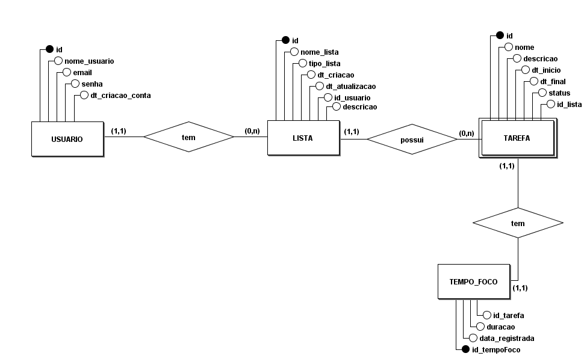

# Lunodoro - Organizador de Tarefas

O Lunodoro é um sistema de organização de tarefas que permite que os usuários se cadastrem, criem e gerenciem listas de tarefas de forma eficiente. Cada usuário pode criar várias listas, que são organizadas por nome e tipo. As listas armazenam múltiplas tarefas, que incluem detalhes como nome, descrição, data de início prevista e data de finalização prevista. Além disso, o sistema rastreia o status das tarefas, indicando se estão pendentes, em progresso ou concluídas. As listas possuem datas de criação e atualização, permitindo aos usuários acompanhar quando foram modificadas pela última vez. Esse sistema oferece uma ferramenta completa para a organização e acompanhamento de tarefas diárias.

Além disso, o Lunodoro possui um sistema de Pomodoro integrado, que permite o gerenciamento de tempo que divide o trabalho em blocos de tempo focado, no qual o usuário selecionará o tempo, seguidos por uma breve pausa.

## MER

