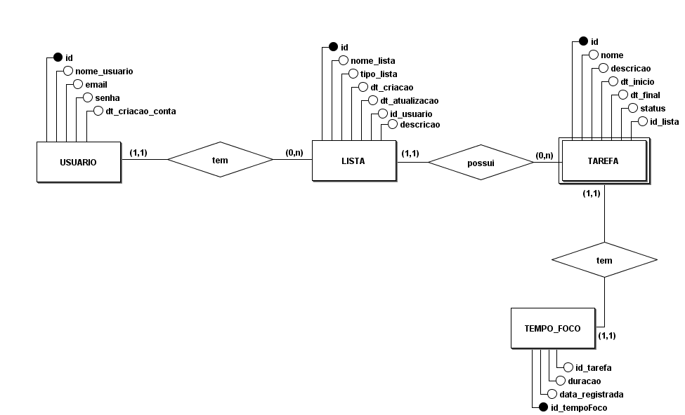

# Lunodoro - Organizador de Tarefas

## Como rodar

### Configurando o banco de dados e servidor
1. Clone o repositório
2. Abra o arquivo `database.sql` no seu editor de SQL
3. Importe o arquivo `database.sql` no seu banco de dados e execute as instruções
4. Rode o apache no seu servidor
5. Altere as configurações do arquivo `.htaccess` para corresponder o caminho do seu servidor

### Configurando o ambiente de desenvolvimento
1. Rode no terminal o comando `cd frontend-react`
2. Rode o comando `npm install` para instalar as dependências
3. Rode o comando `npm run dev` para iniciar o servidor de desenvolvimento
4. Abra o navegador e acesse `http://localhost:5173`

## Descrição
O Lunodoro é um sistema de organização de tarefas que permite que os usuários se cadastrem, criem e gerenciem listas de tarefas de forma eficiente. Cada usuário pode criar várias listas, que são organizadas por nome e tipo. As listas armazenam múltiplas tarefas, que incluem detalhes como nome, descrição, data de início prevista e data de finalização prevista. Além disso, o sistema rastreia o status das tarefas, indicando se estão pendentes, em progresso ou concluídas. As listas possuem datas de criação e atualização, permitindo aos usuários acompanhar quando foram modificadas pela última vez. Esse sistema oferece uma ferramenta completa para a organização e acompanhamento de tarefas diárias.

Além disso, o Lunodoro possui um sistema de Pomodoro integrado, que permite o gerenciamento de tempo que divide o trabalho em blocos de tempo focado, no qual o usuário selecionará o tempo, seguidos por uma breve pausa.

## SESSÃO SEM LOGIN
Para usuários que não estão logados, o sistema irá exibir todas as telas normalmente, no qual os usuários poderão criar e visualizar listas de tarefas, porém com um limite de 3 listas por usuário. Os demais recursos do sistema, como o gerenciamento de tarefas e listas, estarão disponíveis somente para usuários já logados.

## SESSÃO COM LOGIN

Para usuários já logados, o sistema permitirá, além de um gerenciamento de tarefas e listas mais completo, que os usuários possam acompanhar os relatórios que o sistema gera automaticamente.

## MER

